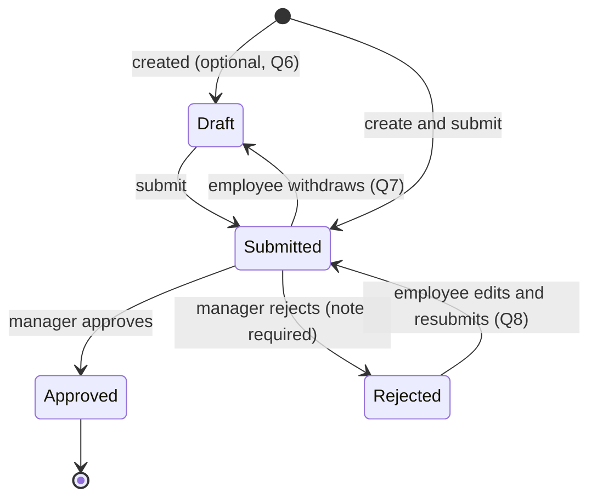

# Feature Summary — Internal Expense Tracker with Approval Flow

**Sources:** kickoff briefing video (verbal transcript) plus the written exercise brief (*Dev Exercise* PDF), both captured 2026-08-23.
**Companion docs:** [infrastructure.md](infrastructure.md) (stack, data model, environments) · [questions.md](questions.md) (open items, each with a proposed default).

Legend used throughout:

| Tag | Meaning |
| --- | --- |
| **[Brief]** | Stated explicitly in the briefing, video or written. |
| **[Client]** | Answered by the client in the Q&A of 2026-08-24. |
| **[Decided]** | Our call — either delegated to us by the client or settled internally. |
| **[Assumed]** | A small detail no question covered. Stated so it is visible rather than silent. |

**Nothing in this document is open.** Every question has an answer; the reasoning behind each one is in [questions.md](questions.md).

---

## 1. What we are building

An internal expense tracker for **a single company**. Employees log expenses they have already incurred — travel, software subscriptions, meals with clients — fill in the details, attach a receipt, and submit for approval. Managers see what has been submitted and either approve it or reject it with a note. Every expense carries a **status** and a **history of what happened to it**. **[Brief]**

Scope posture, in the client's words: *small but real* — the kind of thing you would actually ship to a client, deliberately narrow. The evaluation is on how decisions get made, how the thing is structured, and how edge cases are handled — not on volume of code. **[Brief]**

**Design bar:** from the written brief — *"don't over-invest in design — functional and clean is enough."* **[Brief]**

**Process, per the written brief. [Brief]** Questions go over as a single consolidated list by end of Day 1; answers come back the following day; **no building starts before those answers arrive**; then three days to build and submit. See §9 for what gets submitted.

---

## 2. Users and roles

| Role | Can do | Notes |
| --- | --- | --- |
| **Employee** | Create, submit, and view **their own** expenses; edit them while in draft or after a rejection; see status and history; view their own receipts. | Sees nothing belonging to anyone else. This is the only real scoping boundary in the app. **[Brief]** |
| **Manager** | Everything an employee can do **for their own expenses** — managers are also employees and submit like anyone else **[Client, Q1]** — plus: see every pending expense, open one, approve it, or reject it with a note. | **Any manager can approve any expense; no org-chart relationships.** **[Client, Q2]** They cannot approve their own. **[Client, Q1]** |
| ~~Admin~~ | — | **No admin portal and no admin role.** Accounts are set up manually in the database. **[Client, Q3]** |

Two role types, and authentication so people can log in. **[Brief]**

**There is no self-serve signup.** **[Client, Q4]** Every account is created by the seed script, which makes seeding load-bearing rather than a convenience — see F1 and `infrastructure.md` §11 risk 1.

The written brief requires **two test accounts at submission, one employee and one manager** **[Brief]**. We seed **two managers and two employees** **[Decided, Q30b]**: with self-approval blocked and no signup, a single manager makes a manager's own expense impossible to approve, so a reviewer could never exercise the rule.

---

## 3. Feature list

### F1 — Authentication and session **[Brief]**

- **Sign-in only.** Email + password, no social login **[Brief]**, no sign-up screen **[Client, Q4]**, no password reset, no email verification, no MFA **[Decided, Q26]**. The entire auth surface is: a seeded account signs in and signs out.
- Signed-out users are redirected to sign-in; signed-in users land on their expense list.
- Sign out from anywhere in the app.
- **Accounts are created by the seed script only.** With no signup screen there is no other route into the system — which makes account provisioning a day-one build task, not a finishing touch. Convex Auth password accounts cannot be created with a plain database insert; see `infrastructure.md` §11 risk 1.
- **Edge cases:** wrong-password and unknown-email responses must not reveal which is which; session survives a page reload; an authenticated session whose user record is missing or inactive must fail closed rather than render an empty app.

### F2 — Submit an expense **[Brief]**

- Form fields: **description, amount, category, receipt** **[Brief]**, plus **expense date** — when the cost was incurred, distinct from when it was submitted **[Client, Q14]** — and an optional note to the approver. Nothing else: no merchant, project code, or payment method. **[Decided, Q16]**
- **Categories: travel, meals, software, office supplies** **[Client, Q12]**, **plus Other** **[Decided, Q12]**, read from a seeded `categories` table rather than hard-coded, so the client's "we may want to make them configurable later" is a data change instead of a deployment. **[Decided, Q12]**
- **Exactly one receipt, required.** JPEG, PNG, HEIC, WebP, or PDF up to 10 MB. **[Decided, Q15]** Upload shows progress, confirms the filename or thumbnail, and can be replaced before submit.
- Validation: description non-empty and length-capped; **amount greater than zero, at most two decimal places, no upper bound** **[Decided, Q17]**; date not in the future; category from the allowed set; receipt present.
- **Soft duplicate warning** **[Decided, Q18]**: if the same person already has an expense with the same amount on the same expense date, the form warns before submit. It never blocks — the employee can proceed, and the warning is not recorded on the expense.
- **Edge cases:** double-submit (button disabled plus an idempotent server guard); navigating away mid-upload; upload succeeds but the record fails to save, leaving an orphaned file (see `infrastructure.md` §7); amounts typed as `1,234.56` or `1.234,56`; pasted amounts carrying a currency symbol; HEIC photos straight off a phone; a 25 MB photo hitting the size cap; an unsupported file type such as `.docx`.
- **Draft state included** **[Decided, Q6]** — the client left it to us. It is where a withdrawn expense lands, which keeps the lifecycle coherent rather than special-cased, and it makes a failed receipt upload recoverable.
- **Open recommendation:** the four categories have no catch-all, so a conference ticket, a laptop, or a taxi has nowhere obvious to go. Adding **Other** is one line and prevents the forced miscategorisation that makes category data useless. Not added unilaterally, since the client named a specific list.
- **Known gap, accepted deliberately:** with no amount ceiling (**Q17**), no threshold rule (**Q22**), and a duplicate check that keys on amount and date only (**Q18**, since **Q16** dropped the merchant field), nothing catches an order-of-magnitude typo except the approver's eye. A `50.00` dinner entered as `5000.00` reaches the queue looking normal. Defensible when a human reviews every expense — and recorded rather than discovered.

### F3 — My expenses (employee) **[Brief]**

- List of the signed-in user's own expenses, newest first: description, date, amount, category, status badge.
- Detail view: all fields, receipt preview, current status, and the activity history (F7).
- Filter by status and search by description, matching the manager view. **[Decided, Q19]**
- **Edge cases:** empty state for a brand-new user; long descriptions truncating cleanly; the list must be scoped to the owner on the server — never filtered in the client.

### F4 — Review queue (manager) **[Brief]**

- **Every pending expense in the company**, not a filtered subset — any manager can approve any expense. **[Client, Q2]**
- **Two tabs: Pending** (default, oldest first — whatever has waited longest is most urgent) **and Decided**, plus a status filter and search by description or submitter. **[Decided, Q19]** The client confirmed the pending queue and a clear per-expense history are what matter. **[Client, Q5]**
- Each row: submitter, date, amount, category, description. Clicking a row opens the detail view.
- **No aggregates or KPIs** — the client does not need them for this version. **[Client, Q21]**
- **No bulk approve or reject** — one expense, one deliberate decision. **[Decided, Q20]**
- **Edge cases:** an item decided by another manager while this queue was open (a stale row must fail gracefully, not corrupt state) — now a live concern rather than a theoretical one, since every manager works the same shared queue; a submitter who is inactive; the empty-queue state; **a manager's own expense appears in the queue but is not actionable by them** **[Client, Q1]**.
- **Privacy consequence:** because any manager can act on anything, every manager can see every expense and every receipt in the company, including for people they do not manage. That follows directly from the client's answer and is right for a company of this size — it also means the employee boundary is the only real scoping rule, which raises rather than lowers how much the authorization tests matter.

### F5 — Approve or reject **[Brief]**

- From the detail view: view the information, then approve or reject. **[Brief]**
- **A rejection requires a note.** **[Brief]** An approval note is optional. **[Assumed]**
- The decision is recorded with actor and timestamp and becomes immediately visible to the employee.
- **Edge cases — the ones that matter here:**
  - **Self-approval is blocked on the server**, even though the UI also hides the button. **[Client, Q1]**
  - **Concurrent decisions:** two managers acting on the same expense at the same moment must not both succeed. Guarded inside the mutation by re-checking that the status is still pending; Convex's transactional mutations make that read-then-write safe (`infrastructure.md` §6).
  - Deciding an expense that has been withdrawn or edited since the queue loaded.
  - A rejection note consisting only of whitespace.
  - Authorization is re-checked in the mutation, never inferred from the fact that the client managed to render the row.
- **Exactly two outcomes, and decisions are final.** No "needs more info" state (**Q11**), no approval thresholds (**Q22**), and **no reversal — once a decision is made it stands** **[Client, Q9]**. A mistake is corrected by the employee submitting a fresh expense.
- Because decisions are irreversible, the confirmation step matters: approving or rejecting is a deliberate action with the amount and submitter visible at the point of confirming, not a bare button on a list row.

### F6 — Status lifecycle **[Brief]**

An expense always has a status, and that status is the single thing both sides key off. See §4.

### F7 — Activity history / audit trail **[Brief]**

- Append-only chronological list on each expense: what happened, who did it, when, and any note attached.
- Events: created, submitted, edited, receipt replaced, approved, rejected, resubmitted, withdrawn — each with actor, timestamp, and note. **[Decided, Q23]**
- **Edits record field-level before-and-after values**, so an edit-then-resubmit leaves a reviewer able to see exactly what moved. **[Decided, Q23]**
- **The employee and the manager see the same history.** **[Decided, Q23]**
- Never mutated or deleted, including when the underlying expense is edited.

### F8 — Receipt viewing

- Inline preview for images; embedded or new-tab view for PDFs; download link.
- **Access is authorized on the server:** an authorization-gated query hands back the storage URL only to a caller entitled to see that expense; unauthorized callers get nothing. **[Decided, Q15]** The residual property — the issued URL then works for anyone holding it — and the stronger alternative are both in `infrastructure.md` §7.
- **Edge cases:** a missing or deleted file; a multi-page PDF; very large images on mobile.

### F9 — Application shell and role-aware navigation **[Assumed]**

- Persistent navigation reflecting the role: employees get "My Expenses" and "New Expense"; managers additionally get "Review".
- Deep links are enforced on the server. An employee opening a manager route, or anyone opening someone else's expense by ID, gets a clean not-found/not-authorized result — not a partial render.

### F10 — States and feedback **[Assumed]**

- Loading, empty, error, and success states for every list and every action. Convex queries are reactive, so both sides see a decision land without a manual refresh.
- Currency and dates formatted through `Intl` using the expense's own currency — no hardcoded `$`, because multi-country is on the roadmap.

---

## 4. Status lifecycle

| Status | Meaning | Who can change it | Employee can edit? |
| --- | --- | --- | --- |
| `draft` **[Decided, Q6]** | Started, and **visible only to its owner** — not to managers, by URL or otherwise. | Owner | Yes |
| `submitted` **[Brief]** | Awaiting review; appears in every manager's queue. | Owner (withdraw), Manager (decide) | **No — withdraw to draft first** **[Decided, Q7]** |
| `approved` **[Brief]** | Signed off. **Terminal.** **[Decided, Q10]** **[Client, Q9]** | — | No |
| `rejected` **[Brief]** | Declined, with a required note explaining why. | Owner (edit and resubmit) | **Yes — same expense is corrected and resubmitted** **[Decided, Q8]** |

**Ruled out:** no `paid`/`reimbursed` state (**Q10**), no `changes_requested` state (**Q11**), and no reversal of a decision (**Q9** **[Client]**). Four statuses is the whole model.

**Why withdraw-then-edit rather than edit-in-place** (**Q7**, delegated to us): an editable pending expense means a manager can approve something other than what they read. The alternative guarantee — version-stamping each decision so an approval refuses if the expense changed underneath it — is more machinery for the same outcome. The client asked for rules that are clear; "pending expenses are locked, withdraw to change one" states in one sentence.

---

## 5. Screens

| Route | Who | Purpose |
| --- | --- | --- |
| `/signin` | Anonymous | Email + password. **No `/signup` route** — accounts are seeded. **[Client, Q4]** |
| `/expenses` | Employee, Manager | My expenses list. Default landing page. |
| `/expenses/new` | Employee, Manager | Submission form with receipt upload. |
| `/expenses/[id]` | Owner, authorized manager | Detail: fields, receipt, status, history. Approve/reject controls render only for an authorized reviewer. |
| `/review` | Manager | Review queue, pending by default. |

One detail route serving both audiences, with capabilities decided on the server, keeps authorization in a single place instead of two near-identical pages that drift apart.

---

## 6. Cross-cutting rules and edge cases

**Authorization**

- Every query and mutation resolves the caller's identity and role on the server. The client is never trusted for scoping or capability.
- Reads are scoped by index, not fetch-then-filter — no pulling a company-wide table and filtering in JavaScript.
- Object-level check on every read by ID: can *this* user see *this* expense?
- Self-approval blocked server-side. Role escalation is impossible from the client, because roles live in the app database rather than in client-editable state.

**Data integrity**

- Amounts stored as integer minor units plus an ISO-4217 currency code — never floats (`infrastructure.md` §8).
- Status transitions validated against an allowed-transition map and rejected otherwise.
- History rows are append-only.
- Rejection note required and non-blank at the moment of transition, enforced server-side.

**Concurrency**

- Double-submit, double-approve, and approve-versus-withdraw races are all guarded by re-reading status inside the transaction.

**Files**

- Type and size validated on the client *and* the server; client validation is a UX affordance, not a control.
- Receipt URLs returned only to authorized callers.
- Orphaned uploads — file stored, expense never saved — are a known cleanup case.

**Money and locale**

- No hardcoded currency symbol and no `en-US` assumption anywhere in the UI.

**Time**

- Timestamps stored as epoch milliseconds in UTC. The expense *date* is a calendar date, which is a different thing, and it has to survive a timezone boundary without shifting a day.

---

## 7. Out of scope for v1

Never mentioned in the brief, and excluded without further discussion: reimbursement or payment execution, accounting and payroll integration, OCR receipt scanning, mileage calculation, per-employee budgets or a policy engine, corporate-card feed reconciliation, mobile apps, threaded discussion on an expense, and analytics dashboards.

Considered and **ruled out** as decisions rather than oversights **[Decided]**:

| Excluded | Question |
| --- | --- |
| Admin portal and admin role — accounts set up manually in the database | **Q3** **[Client]** |
| Self-serve signup | **Q4** **[Client]** |
| Reversing or changing a decision after the fact | **Q9** **[Client]** |
| Aggregate figures and KPIs | **Q21** **[Client]** |
| Org-chart relationships between employees and managers | **Q2** **[Client]** |
| `paid`/`reimbursed` state | **Q10** |
| "Needs more info" outcome | **Q11** |
| Email notifications on submission or decision | **Q24** |
| CSV export and reporting | **Q25** |
| Bulk approve or reject | **Q20** |
| Approval thresholds and auto-approval | **Q22** |
| Password reset, email verification, MFA, sign-in throttling | **Q26** |
| Extra expense fields (merchant, project code, payment method) | **Q16** |
| Multi-currency UI, FX, per-country policy, teams, `orgId` | **Q13**, **Q27** |
| Multi-level approval chain | **Q28** |

Worth naming the one that bites in use: with **no email (Q24)**, a manager only discovers new submissions by opening the app. Live-updating queries mean anyone with the page open sees changes instantly, but nobody gets pulled in. That is the right call for a three-day build and the first thing a real deployment would add.

---

## 8. Built to absorb, not built now

The brief flags two future directions. **Both are confirmed as absorb-only, not build-now** (**Q27**, **Q28**) **[Decided]** — neither is implemented, and both are made cheap by decisions taken now.

| Roadmap item **[Brief]** | What v1 does about it | What v2 would add |
| --- | --- | --- |
| **Teams across different countries** | Currency stored per expense (code plus minor units) from day one; all formatting through `Intl`; no `$` or `en-US` hardcoded; timestamps in UTC; the user record has room for country and team without a rewrite. | A `teams`/`offices` table, per-country categories and policy limits, a reporting currency plus FX rates, and country-scoped manager visibility. |
| **Multi-level approvals** | Approval authority is decided by one server-side boundary, `canDecide(user, expense)`, rather than scattered `status === "submitted"` checks in components. History is already an append-only event log, so a chain of decisions is representable without schema surgery, and status stays a denormalized rollup. | An `approvalSteps` table (one row per required approval), a rule for what triggers a second approver (amount, category, or country), sequential-versus-parallel semantics, and rollup logic that sets the expense status when the chain completes. |

**Explicitly not doing:** no `orgId` and no multi-tenancy. The brief says one company, and the roadmap is multi-*country*, not multi-*customer*. Speculative tenancy columns cost clarity today and would probably be the wrong shape anyway. **[Decided, Q27]**

---

## 9. Delivery constraints **[Brief]**

From the written brief — non-negotiable, and they shape the build:

| Requirement | Detail |
| --- | --- |
| **Public GitHub repository** | Must be public. |
| **`README.md`** | Setup instructions. |
| **`.env.example`** | Placeholder values for **every** required environment variable. |
| **Live deployment URL** | Vercel or similar. Fully functional — *tested before anything else*. |
| **Two test accounts** | One employee, one manager, each with email and password, so a reviewer logs straight in. |
| **Timeline** | One consolidated question list by end of Day 1 → answers the next day → three days to build and submit. No building before the answers land. |

The load-bearing line is "fully functional at the live URL, tested first": the production Convex deployment, receipt uploads, and both seeded logins all have to work against the deployed frontend, not just locally. That is a deployment-verification task in its own right rather than an afterthought — see `infrastructure.md` §9 and §13.

---

## 10. Definition of done

- [ ] An employee can sign up, sign in, submit an expense with a receipt, and see it as pending.
- [ ] A manager sees it in their queue, opens it, views the receipt, and approves or rejects with a note.
- [ ] The employee sees the outcome — and the reason, if rejected — without a manual refresh.
- [ ] Each expense shows an accurate, append-only history of everything that happened to it.
- [ ] An employee cannot see or act on anyone else's expense, by URL or by direct API call.
- [ ] A manager cannot approve their own expense.
- [ ] Two simultaneous decisions cannot both land.
- [ ] Receipts are not reachable by unauthorized users.
- [ ] Every list has a sensible empty state; every action has a visible outcome.
- [ ] Amounts and dates are correct, consistently formatted, and locale-safe.
- [ ] A manager can submit an expense, cannot approve it themselves, and a second manager can (**Q1**).
- [ ] An employee cannot edit a pending expense, but can withdraw it, edit it, and resubmit (**Q7**).
- [ ] A rejected expense can be corrected and resubmitted, with the rejection and the edits both visible in its history (**Q8**).
- [ ] Submitting the same amount on the same date twice produces a warning and still lets the employee through (**Q18**).
- [ ] Edits recorded in the history show which fields changed, and from what to what (**Q23**).
- [ ] Backend tests cover the authorization matrix and the status-transition map, plus unit tests for money and date handling and one end-to-end happy path (**Q31**).
- [ ] Public repo, `README.md` with setup steps, and `.env.example` covering every required variable.
- [ ] The live URL works end to end — sign in, upload a receipt, decide — against the production Convex deployment.
- [ ] Employee and manager test credentials verified on the deployed URL, not just locally.

---

## Appendix — requirement traceability

| From the briefing | Where it lands |
| --- | --- |
| "internal expense tracker with an approval flow" | §1 |
| "employees at a single company can log expenses" | F2, §8 (no multi-tenancy) |
| "travels, software subscriptions, meals with clients" | Category list — **Q12** |
| "fill in the details, they upload the receipt, and they submit it for approval" | F2, F8 |
| "managers can see the submitted expenses and approve or reject them" | F4, F5 |
| "two types of users… you'll need authentication" | §2, F1 |
| "employees should see their own expenses. Managers should see what needs their review" | F3, F4, §6 |
| "a description, an amount, a category, and a receipt" | F2 |
| "if you reject, you probably should leave a note" | F5 — note required |
| "a status of an expense and a history of what happened" | F6, F7 |
| "don't need to go overboard on design… functional and usable" | §1, F9, F10 |
| "support teams across different countries" | §8 |
| "multi-level approvals… sign-off from more than one person" | §8 |
| "for the backend, please use Convex" | `infrastructure.md` |
| "Convex's built-in authentication or… Clerk" | **Decided: Convex Auth** — `infrastructure.md` §4; residual lifecycle questions in **Q26** |
| "email and password login is fine… no social login" | F1 |
| "front end… whatever React setup… Next.js is totally fine" | `infrastructure.md` §2 |
| "send over your clarifying questions in writing" | `questions.md` |
| *Written brief:* one consolidated question list by end of Day 1, answers next day, then three days to build | §1, §9 |
| *Written brief:* public repo, `README.md`, `.env.example`, live URL, two test accounts | §9, §10, `infrastructure.md` §13 |
| *Written brief:* "don't over-invest in design — functional and clean is enough" | §1 |
| *Written brief:* "we're evaluating the decisions you make and how you structure things" | Whole document; **Q30(a)** on committing the reasoning trail |
